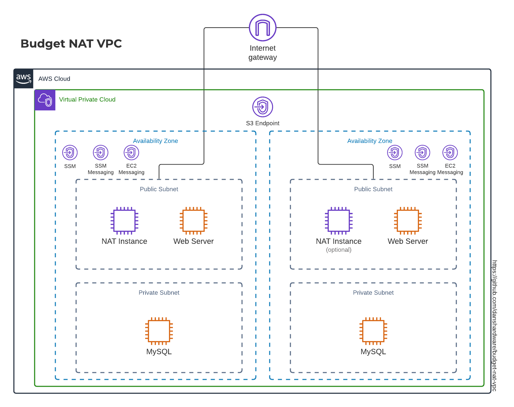

# Budget NAT for VPCs

*[AWS VPC Templates](https://github.com/danshardware/budget-nat-vpc) using budget NAT instances, assembled by Dan Afonso*

## What is it?

This is a CloudFormation template that will spin up a VPC with 2 public subnets,
2 private subnets, 1 or 2 NAT gateways, some service endpoints for SSM and S3, and
tag everything with a `CostCenter` tag, as well perform some traffic shaping/limiting.



This allows you to quickly spin up a VPC that has NAT without paying the fee for managed
NAT Gateways, and do it easily. I included bandwidth shaping and limiting to prevent issues
where a rogue instance tries to saturate your pipe. The limits give you time to respond to alerts
before your bill goes out of control.

## Why would I want this?

NAT Gateways are expensive, relative to test workloads much of the time. They are about $45/mo +
traffic + processing fees based on how much work they need to do. This solution runs about $3/mo in
us-east-2

## Why would I not want this

AWS's managed NAT Gateways are far superior in terms of reliability, durability, and scalability. If you
depend on NAT for time-sensitive production functions, you should use managed NAT gateways and do the
necessary monitoring and securing required to contain costs in the event of a bandwidth tsunami.

## How do I use it?

It's a CloudFormation template. Create a stack in the console, fill out the form, and let it spin up
the VPC. From there, add your resources into the appropriate subnets in the new VPC.

If you want to run it from the command line, do the following:

1. copy `parameters.template.json` to `parameters-${env}.json` (replace `${env}` with whatever
    prefix you will give these resources. `dev`, `prod`, or `test` work well)
1. Edit the file so the parameters match what you want
1. run

    ```sh
    aws cloudformation deploy --template-file ${file} --stack-name ${stackName} \
    --parameter-overrides file://./parameters-${env}.json \
    --capabilities CAPABILITY_IAM
    ```

    and replace the variables as appropriate:
    * `${file}` should be the template you chose
    * `${stackName}` is what this will show up as in cloud formation. I'd go with something like `DEV-VPC`
1. Check the console for updates and fix any issues that arise

Any new instances you bring up in the new VPC should have a role attached that allows access from SSM, preventing you
from needing to use SSH and bastions.

## Updating the AMI mappings

I've included a script that will create a new mapping section for the file with updated AMIs. AWS tends to update these
fairly regularly. I use the script (requires boto3 amd PyYAML available), to update the mapping section every once in a while.
Make a virtual environment (`python3 -m venv venv`), run the activate script (depends on OS you're using), install the modules
(`pip -r requirements.txt`), setup your environment to connect to AWS, and run it (`python update_mappings.py`). After it runs,
copy and paste the `Mappings:...` section into the template.

You can re-deploy with new mappings as maintenance. Since this re-provisions the machine each time you change the AMI,
this prevents the need to run updates on the NAT instances. There will be a short down time as the new instances come up.

## Bonus: My tasks.json file

When developing in VSCode, it helps to have hot keys to deploy. I tap into the default mapping for "Build" in VSCode. Here's my file:

```JSON
{
    // See https://go.microsoft.com/fwlink/?LinkId=733558
    // for the documentation about the tasks.json format
    "version": "2.0.0",
    "tasks": [
        {
            "label": "validate-template",
            "type": "shell",
            "command": "aws cloudformation validate-template --template-body file://${file} --profile personal",
            "group": {
                "kind": "test",
                "isDefault": true
            },
            "problemMatcher": [],
            "presentation": {
                "panel": "new"
            }
        },
        {
            "label": "deploy",
            "type": "shell",
            "command": "aws cloudformation deploy --template-file ${file} --stack-name ${fileBasenameNoExtension} --parameter-overrides file://./parameters-testing.json --capabilities CAPABILITY_IAM --profile personal",
            "group": {
                "kind": "build",
                "isDefault": true
            },
            "problemMatcher": [],
            "presentation": {
                "panel": "new"
            }
        },
        {
            "label": "outputs",
            "type": "shell",
            "command": "aws cloudformation describe-stacks --stack-name ${fileBasenameNoExtension} --query 'Stacks[0].Outputs[0]' --profile personal",
            "problemMatcher": [],
            "presentation": {
                "panel": "new"
            }
        },
        {
            "label": "delete-stack",
            "type": "shell",
            "command": "aws cloudformation delete-stack --stack-name ${fileBasenameNoExtension} --profile personal",
            "problemMatcher": [],
            "presentation": {
                "panel": "new",
                "reveal": "never"
            }
        }
    ]
}
```
